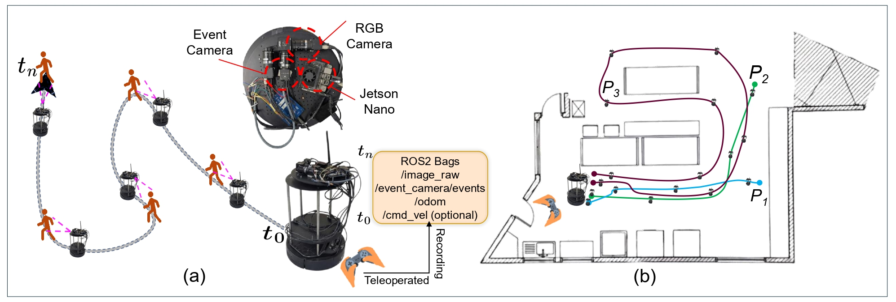

# Updates
<!-- syntax for updating -->
<!-- - [6 August 2025] Tool for Manual Annotation Release -->

# *eNavi*: Event-based Imitation Policies for Low-Light Indoor Mobile Robot Navigation

<!-- for adding link to paper and image -->
<div>
<a href="">Paper</a> | 
<!-- <a href="https://drive.google.com/file/d/1tlwI928wwzoIaphzWcdPFxZYTYJ-hMQC/view?usp=sharing">Supplementary</a> | -->
<a href="https://eventbasedvision.github.io/eNavi/">Website</a>
</div> 

<hr>

<div style="text-align: center;">

</div>

<p align="justify">
Event cameras have emerged as a powerful sensing modality for robotics, offering microsecond latency, high dynamic range, and low power consumption. This work presents eNavi, a multimodal imitation learning framework that fuses RGB and event camera data for low-light indoor mobile robot navigation. We introduce the eNavi dataset (~2 hours, 175+ episodes across 3 environments) and the ENP policy architecture — a late-fusion transformer that combines MobileNetV3-Small encoders for RGB and event modalities with attention-based fusion. Experimental results show that event-driven fusion policies converge faster, achieve lower error, and generalize better to unseen low-light conditions compared to RGB-only baselines.
</p>

## Dataset

The dataset is available <a href="https://www.dropbox.com/scl/fo/ywn9hx1pj1fgv4gx2pyam/ADNASSQ_FuqK6blus3aaiVo?rlkey=4qu9j1ecs0xk6ibo8dnwbmlav&e=1&dl=0">here</a>.

## Repository Structure

```bash
eNavi/
├── model/
│   ├── best_val_checkpoints/
│   │   ├── all_event_e036_val0.037868.pt
│   │   ├── all_fusion_e021_val0.040255.pt
│   │   ├── all_low_event_e010_val0.041625.pt
│   │   ├── all_low_fusion_e022_val0.037018.pt
│   │   ├── all_low_rgb_e050_val0.070717.pt
│   │   ├── all_rgb_e050_val0.066733.pt
│   │   ├── p1_event_e029_val0.039339.pt
│   │   ├── p1_fusion_e019_val0.038856.pt
│   │   ├── p1_low_event_e018_val0.038860.pt
│   │   ├── p1_low_fusion_e023_val0.035876.pt
│   │   ├── p1_low_rgb_e050_val0.058427.pt
│   │   └── p1_rgb_e048_val0.054862.pt
│   └── models.py             # ENP architecture (RGB, Event, Fusion variants)
├── train_logs_ENP.pdf        # Training and validation logs for all 12 variants
├── index.html                # Project website
├── LICENSE
└── README.md
```

# License

<a rel="license" href="http://creativecommons.org/licenses/by-sa/4.0/"></a><br />This work is licensed under a <a rel="license" href="http://creativecommons.org/licenses/by-sa/4.0/">Creative Commons Attribution-ShareAlike 4.0 International License</a>.


# Citation
If you use our package, we appreciate a citation to our paper and to the original author of v2e. 

```bash
@inproceedings{ramesh2025enavi,
  title     = {eNavi: Event-based Imitation Policies for Low-Light Indoor Mobile Robot Navigation},
  author    = {Ramesh, Prithvi Jai and Chanda, Kaustav and Vinod, Krishna and Vishal, Joseph Raj and Chakravarthi, Bharatesh},
  booktitle = {},
  year      = {2025}
}

```

